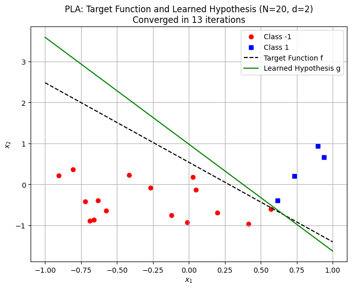
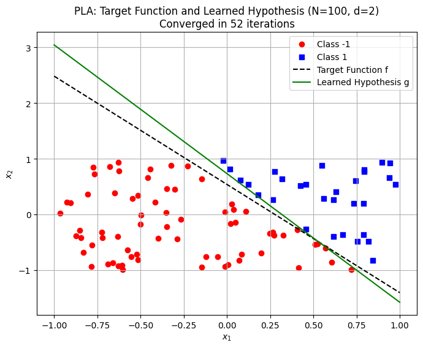
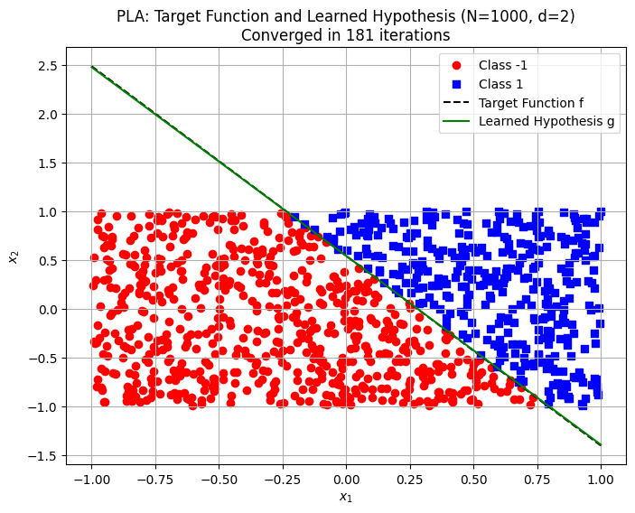
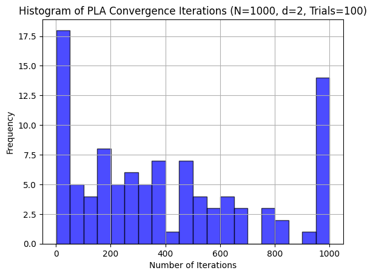

# The Perceptron Learning Algorithm

The Perceptron Learning Algorithm is a foundational concept in machine learning, particularly for understanding how to implement models with linearly separable datasets.

## Overview

This project demonstrates the implementation of the Perceptron Learning Algorithm using a linearly separable dataset. The problem (1.4 a-e) is taken from the book "Learning From Data".

## Contents

- [Introduction](#introduction)
- [Dataset Generation](#dataset-generation)
- [Perceptron Learning Algorithm](#perceptron-learning-algorithm)
- [Results](#results)
- [Figures](#figures)

## Introduction

The Perceptron Learning Algorithm is a simple yet powerful algorithm used for binary classification tasks. It works by finding a hyperplane that separates two classes in a linearly separable dataset.

## Dataset Generation

The dataset used in this project is generated randomly and is linearly separable. The dataset generation process involves creating random points and assigning labels based on a target hyperplane.

## Perceptron Learning Algorithm

The Perceptron Learning Algorithm iteratively adjusts the weights of the model to minimize classification errors. The algorithm continues until all points are correctly classified or a maximum number of iterations is reached.

## Results

The results of the Perceptron Learning Algorithm are visualized through plots. These plots show the target function and the learned hypothesis after the algorithm has converged.

## Figures

### Fig1

### Fig2

### Fig3

### Fig4

## Conclusion

The Perceptron Learning Algorithm is an essential building block for understanding more complex machine learning algorithms. This project provides a hands-on implementation and visualization of the algorithm's performance on a linearly separable dataset.

## References

- "Learning From Data" by Yaser S. Abu-Mostafa, Malik Magdon-Ismail, and Hsuan-Tien Lin